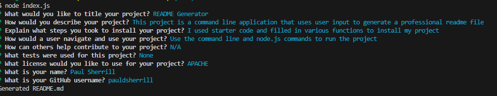
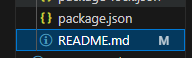
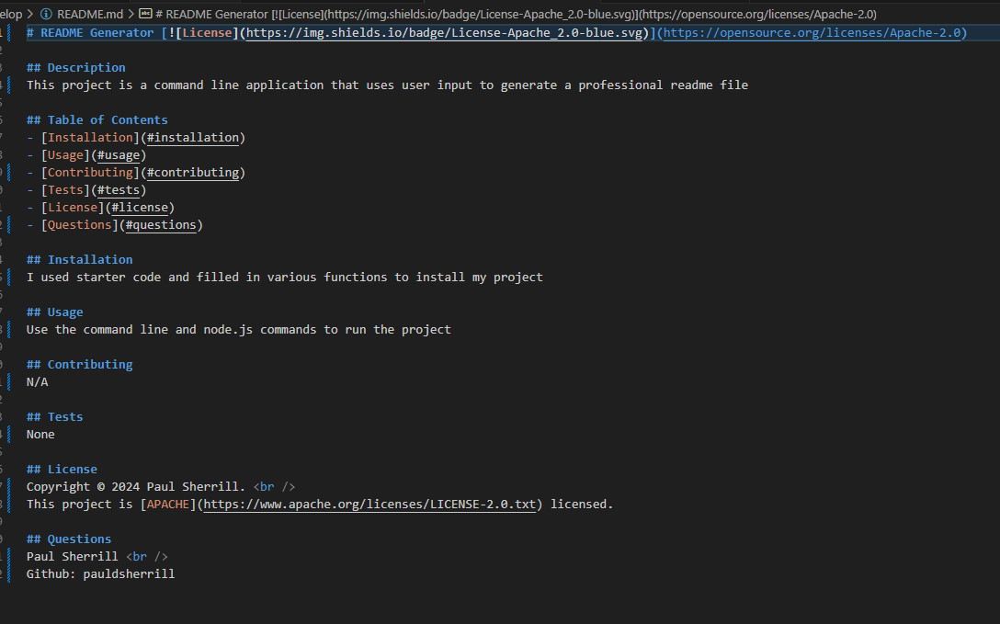
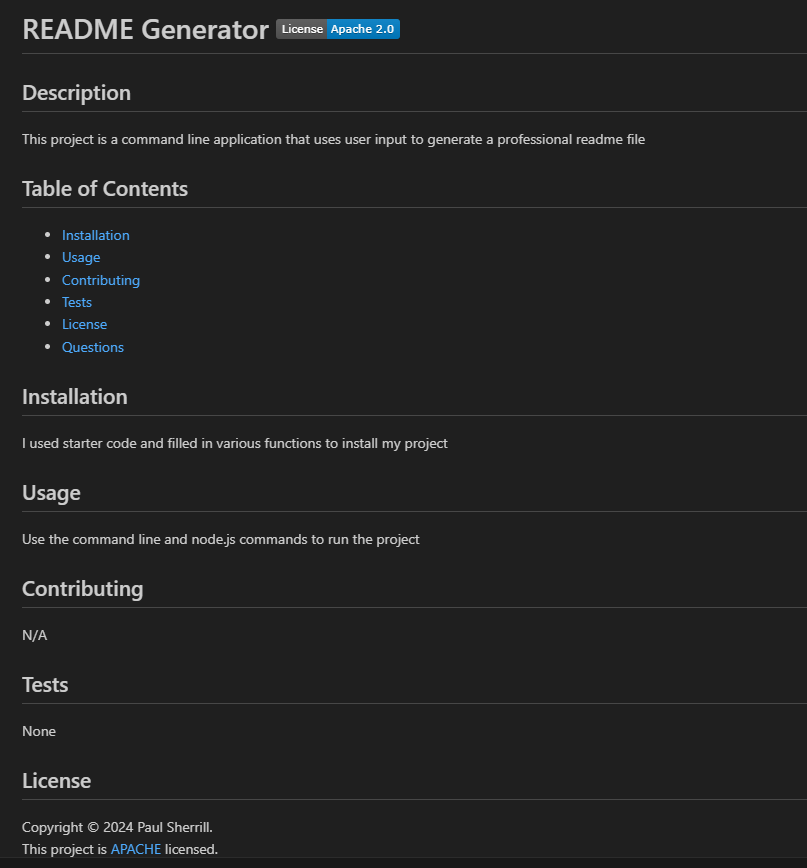

# Logo Generator

## Description

In this challenge, I was tasked with creating a Node.js command line application that takes in user input regarding a project they have completed or are working on and generates a readme.md file. The application asks the user various questions regarding the project to render a project title, as well as description, installation, usage, contributing, tests, license, and questions categories on the readme. 

## Installation

To install my code, I was given starter code with empty functions that I was tasked with filling in to make the application properly. 

The first step I took was creating a prompt with all the questions I needed to ask the user on the command line. I did so by installing inquirer and using the inquirer.prompt command and creating all the questions I needed to ask to get the necessary input to make a professional readme. I used the assignment acceptance criteria to get a basis of what to ask the user for each part of the readme.

My next step was to create a function that rendered the correct text and formatting onto a readme.md file. I did so by going to the utils folder and filled in the starter code in called 'generateMarkdown'. More specifically, I first filled in the functions to render the license badges and links because those functions had already been started for me. I rendered these by searching for the correct URLs for each available license the user could choose and using an if statement to make sure each badge or link was only created if the user hads selected that specific license. I then added these functions to the renderLicenseSection function. From there, I filled in the generateMarkdown function by returning a string of text to be rendered onto the file. I then filled in the categories with the answers variable pulled from the prompt answers. To make sure each section was filled in with the correct information, I made sure to attach the correct prompt name onto the answers variables. 

The final step was to export this function to the index.js file and put it into a fs.writeFile function so that the application knew to create a readme.md file and render this text onto said file after the prompts had been answered by the user. To notify the user of this, I made sure to console.log a message saying "Generated README.md'.

## Usage

CLick on the link to see a video to see a walk through video of the application https://app.screencastify.com/v3/watch/JAZt4wHUjhFGGJi8W1iK

Once you arrive to the application on the terminal, you will see a prompt asking what you would like to title your project. When answered you will then be asked to add a description of your project. After this is answered, you will be asked to explain the steps you took to install your project. After this is answered, you will be asked to explain how a user can navigate and use your project. You will then be asked if there are ways others can contribute to your project and after that you will be asked to include any tests you used for your project. AFter that, you will be asked ot select a license to use for your project and finally, you will be asked for your name and GitHub username.

From there, you should see a message saying "Generated README.md".

You will then see a new file created called README.md with all the code for your professional README file. 

Upon opening the preview for this, you should see the title for your project with a license badge of your chosen license next to it. Underneath you should see a description of your poject as well as a table of contents to navigate the README. You will then see underneath that Installation, Usage, Contributing, Tests, License, and Questions sections with all your input and data about you and your project. In the License section you will be taken to the license URL link when clicking the name of the license. 

